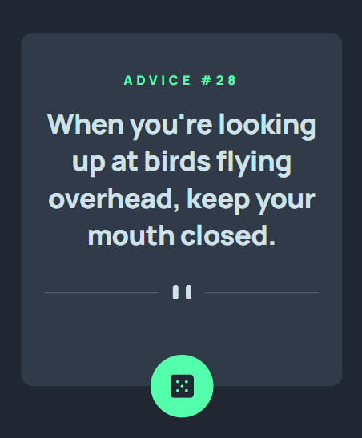
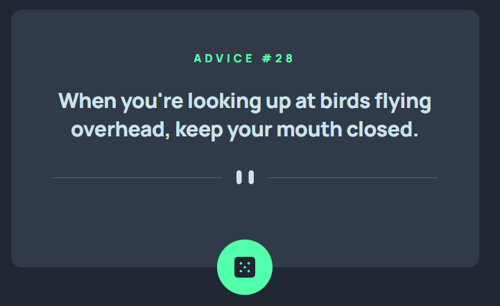

# 📌 Advice Generator App

## 📝 Descripción
Este proyecto es una solución al reto **Advice Generator App** de [Frontend Mentor](https://www.frontendmentor.io/). La aplicación consume la [Advice Slip API](https://api.adviceslip.com/) para mostrar un consejo aleatorio cada vez que el usuario presiona el botón de dado. El objetivo principal fue construir una interfaz responsive (mobile → desktop) totalmente tipada con TypeScript estricto, sin usar `any` en ningún punto del código, y con un sistema de diseño propio armado a mano sobre Tailwind CSS v4.

---

## 📸 Capturas de pantalla

### 📱 Vista Mobile

### 💻 Vista Desktop

---

## 🛠 Tecnologías utilizadas
- React
- TypeScript
- Vite
- Tailwind CSS
- Oxlint
- pnpm
- Advice Slip API

---

## 🚀 Retos
El mayor reto fue tipar correctamente la respuesta de la API sin recurrir a `any`, ya que configuré TypeScript en modo `strict` con la regla de lint `no-explicit-any` activada. Terminé resolviéndolo con funciones *type guard* (`isAdvice`, `isSlip`) que validan la forma del `unknown` que devuelve `fetch` antes de usarlo como `Advice`. Otro desafío fue maquetar la card mobile-first y luego adaptarla a desktop sin duplicar lógica: usé clases `md:` de Tailwind para cambiar tamaños de texto, paddings y anchos, y dos imágenes de divisor (mobile/desktop) que se alternan según el breakpoint solo con CSS, sin JavaScript. También armé mis propios `@theme` y `@utility` en Tailwind v4 para los colores y los *text presets* del estilo guía, en vez de usar clases sueltas repetidas por todo el componente.

---

## 📚 Aprendizajes
Aprendí a configurar Tailwind CSS v4 en su modo "CSS-first", usando `@theme` para definir tokens de color y tipografía personalizados y `@utility` para crear clases reutilizables con `@apply`. También reforcé el uso de *type predicates* (`data is Advice`) en TypeScript como alternativa segura a `any` cuando se trabaja con datos externos de una API, y practiqué el manejo de estados de carga (`isLoading`) y deshabilitado del botón mientras se espera la respuesta del fetch.

---

## 👨‍💻 Autor
**Anguiano**
